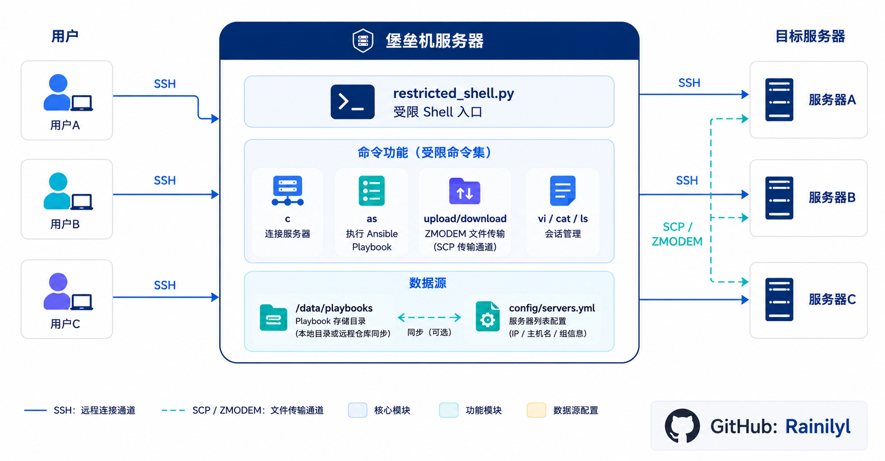

# BastionPlayHub

[中文](README.md) | [English](README.en.md)

Lightweight terminal bastion host. Users SSH in and enter a restricted shell with predefined commands for server management, Ansible Playbook execution, and file transfer.

## Features

- Restricted shell — no arbitrary command execution
- IP / hostname prefix matching for quick connection
- Single or batch Ansible Playbook execution
- ZMODEM file transfer — files never persist on bastion
- Per-session isolation with auto-cleanup on exit
- Supports remote repository sync or local Playbook directory

## Architecture



## Deployment

```bash
git clone git@github.com:Rainilyl/BastionPlayHub.git
cd BastionPlayHub
sudo bash setup/deploy.sh [username]    # default: bastion_user
```

## Post-Deployment

Follow the on-screen prompts after deployment:

**Required**

1. Edit server list
2. Distribute SSH keys to servers
3. Configure user login authentication

**Optional**

- Set up remote repository sync for Playbooks (e.g. GitLab)
- Change Playbook storage path

## Usage

```bash
ssh bastion_user@<bastion_ip>
```

| Command | Description |
|---------|-------------|
| `c` | List all servers |
| `c <IP\|hostname>` | Connect to server (prefix match) |
| `vi host` / `vi hosts` | Edit target hosts |
| `as host <playbook>` | Run Playbook on single host |
| `as hosts <playbook>` | Run Playbook on multiple hosts |
| `ls playbook` | List available Playbooks |
| `upload <IP\|hosts>` | Upload file to server |
| `download <IP\|host>` | Download file from server |
| `clear` | Clear screen |
| `exit` | Exit |